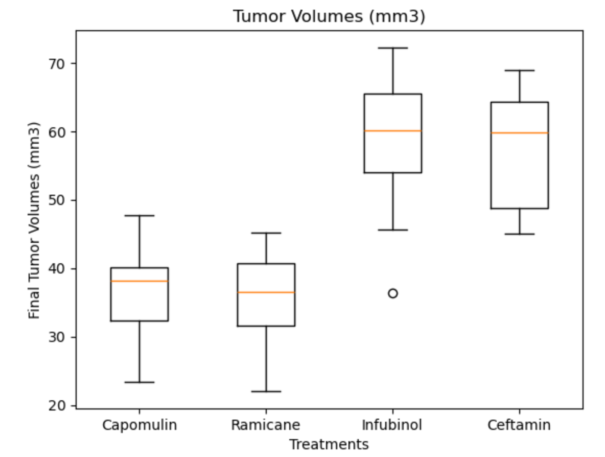

# Visualization-Challenge
This project involves using pandas, its visualization library, along with MatPlotLib to analyze data and producing visualizations.  The data used relate to a study of potential cancer treatment regimens on a large population of cancerous mice.  The purpose was to compare the performance of a particular drug against other treatment regimens.  

The scipy.stats library was also used do perform a linear regression analysis.

Analysis is complete.  The Summary is at the top of the Pymaceuticals Final Code python file.  I have left the jupyter notebook files used in development as well.

Everything for review is present in the python file: Pymaceuticals Final Code
